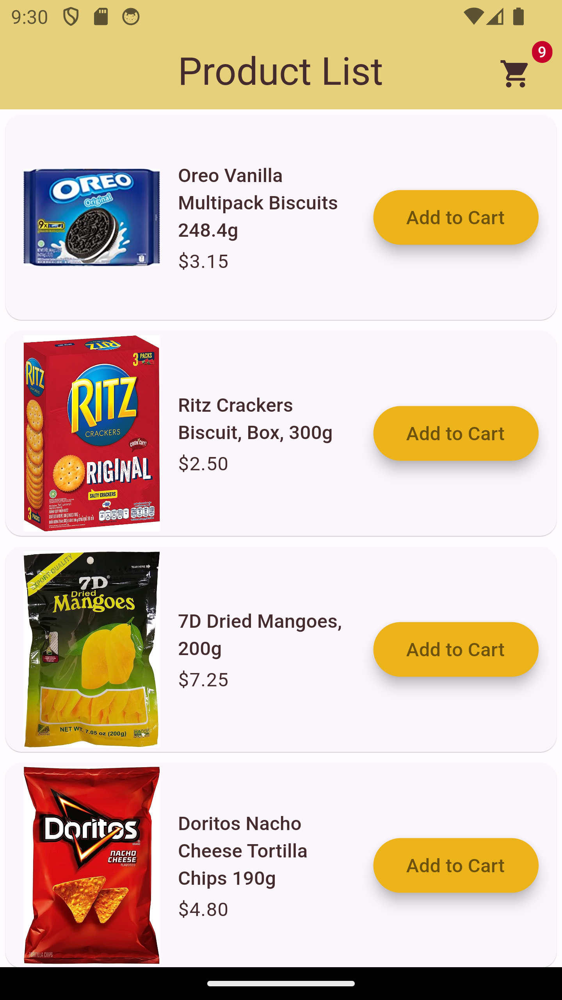
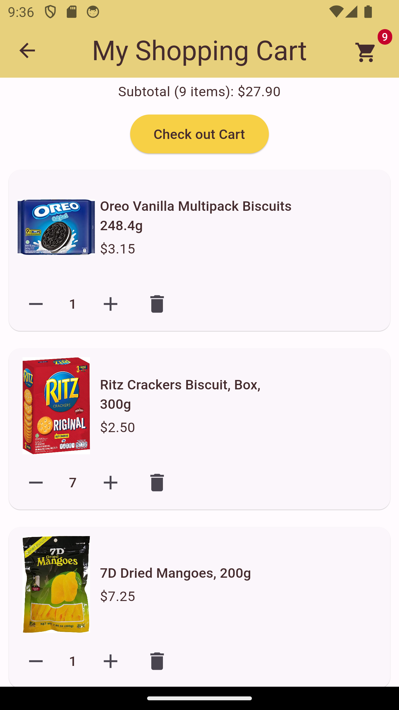
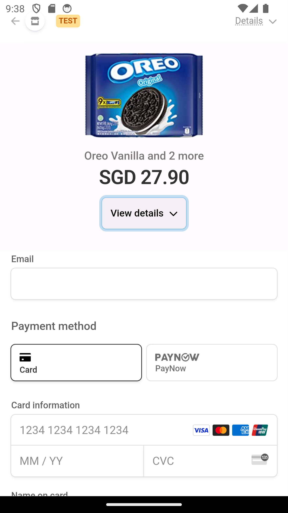
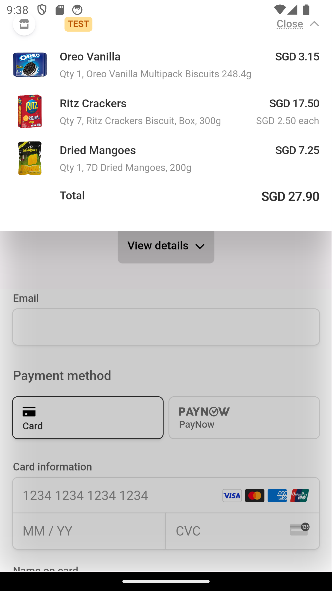
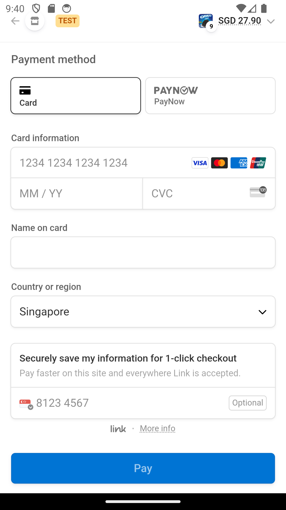
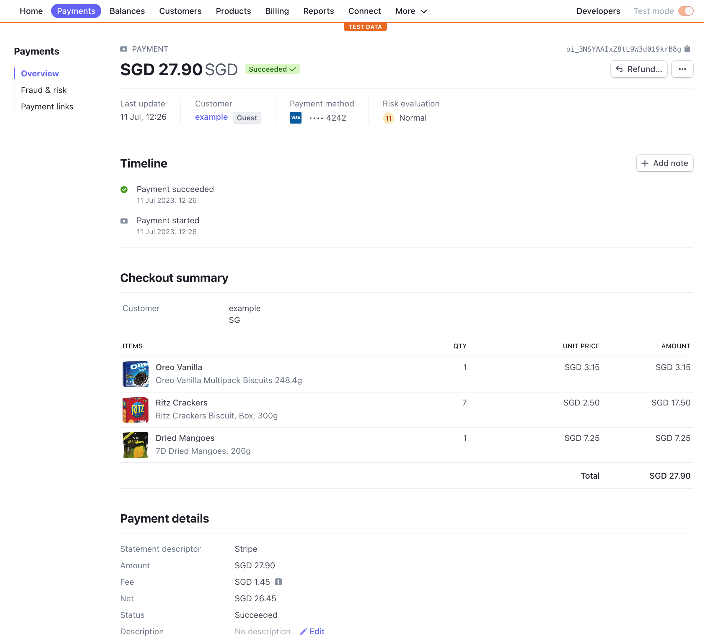

## Shopping cart payment system using stripe checkout, Flutter mobile app and Golang backend services.

---

### Payment System Architecture using Google Cloud Platform services

1. When user hits checkout cart button, Flutter app calls payment-checkout service to get stripe session passing the list of products for payment
2. payment-checkout service calls stripe api to create new session and returns session data to Flutter app
3. Flutter app calls stripe session url link and displays the stripe checkout page via webview widget
4. stripe processes payment (e.g. credit card payment) and calls webhook endpoint configured in your account
5. payment-webhook endpoint will publish the checkout.session.completed event received from stripe to PubSub
6. PubSub message will trigger payment workflow that will call payment-cart service to update cart status and publish event to notification PubSub topic which can be used to send email, sms notification to user. This can also be extended to track delivery.
7. payment-cart service updates cart status in postgreSQL DB.

---

### Screenshots of Flutter app

---

### Checkout page hosted by stripe 
    Displayed in flutter app via webview widget

    
    

---

    

---

### Payment transactions can be viewed from your stripe account 

